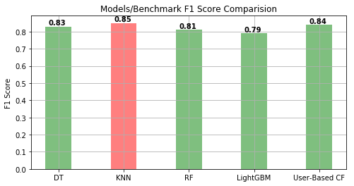

# Machine Learning Engineer Nanodegree
## Specializations
## Project:  Capstone Project
##"Using Machine Learning for Creating a Movie Recommendation System"

### Goal
My goal in this project is to use machine learning to be able to build a movie recommendation system. I was able to create four models; a decision tree classifier, a K nearest neighbor classifier, a random forest classifier and a LightGBM classifier.
The performance of the models is compared to a benchmark model which is the user based collaborative filtering. The K nearest neighbor classifier was able to produce a higher F1 score higher than the benchmark model.

### Install

This project requires **Python 2.7**(if you complete this project in Python 3.x, you will have to update the code in various places including all relevant print statements) and the following Python libraries installed:

- [NumPy](http://www.numpy.org/)
- [Pandas](http://pandas.pydata.org/)
- [matplotlib](http://matplotlib.org/)
- [scikit-learn](http://scikit-learn.org/stable/)

For the LightGBM Model you will need to:
- Install LightGBM using: conda install -c conda-forge lightgbm

- import lightgbm as lgb in your code.

You will also need to have software installed to run and execute a [Jupyter Notebook](http://ipython.org/notebook.html)

If you do not have Python installed yet, it is highly recommended that you install the [Anaconda](http://continuum.io/downloads) distribution of Python, which already has the above packages and more included. Make sure that you select the Python 2.7 installer and not the Python 3.x installer.

### Code

Template code is provided in the `movierecommender.ipynb` notebook file.

### Data

The MovieLens dataset (ml-latest-small) [5] to be used in this capstone project will be taken from ”https://grouplens.org/datasets/movielens/“ the dataset describes a 5-star rating and a free-text tagging activity from a movie recommendation service called “MovieLens”.

**Features**
1.  `userId`:userId represents a unique key for each user.
2. `movieId`: movieId represents a unique key for each user.
3. `genres`:list of the different movie genres separated by '|'.
4. `title`: contains the movie name in addition to the production year.

**Target Variable**
4. `rating`: Ratings of movies out of 5, with half-star increments.
